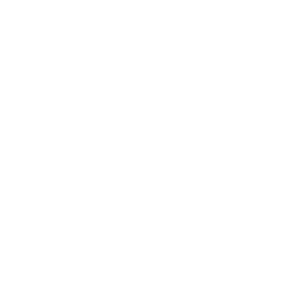
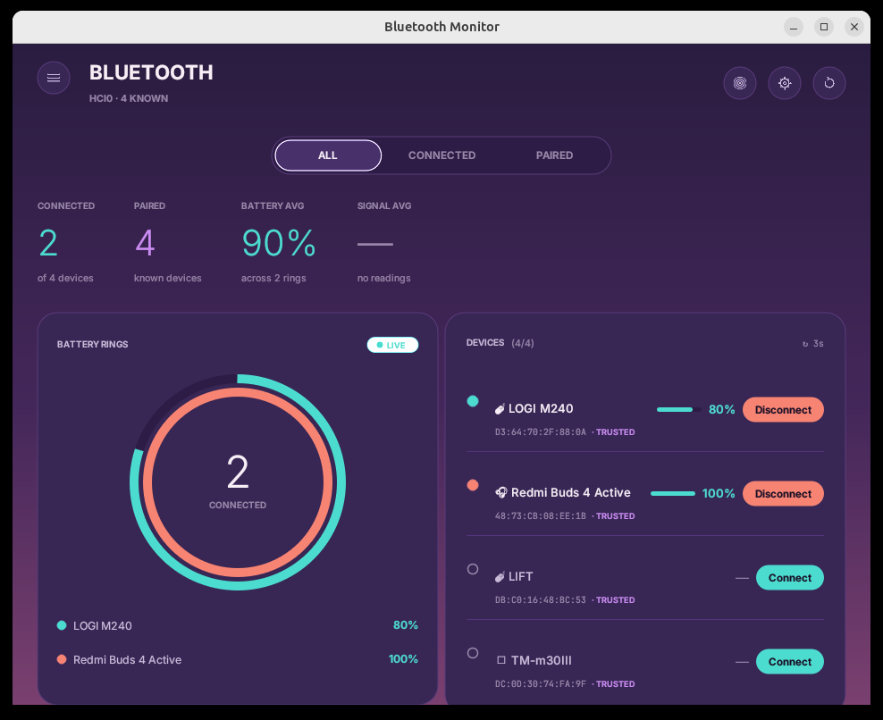
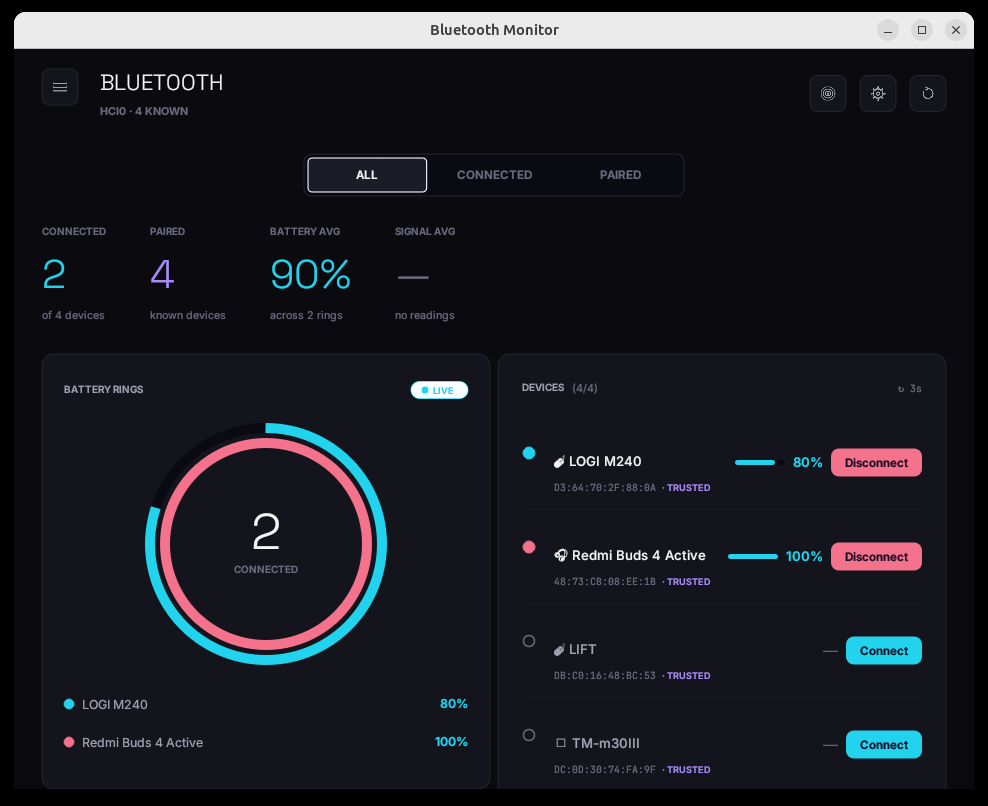
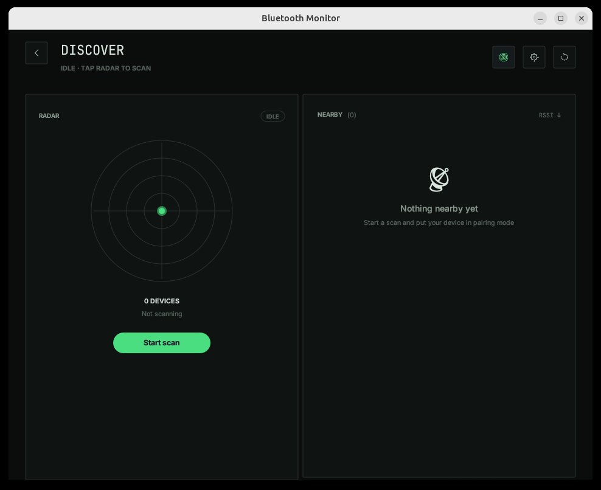
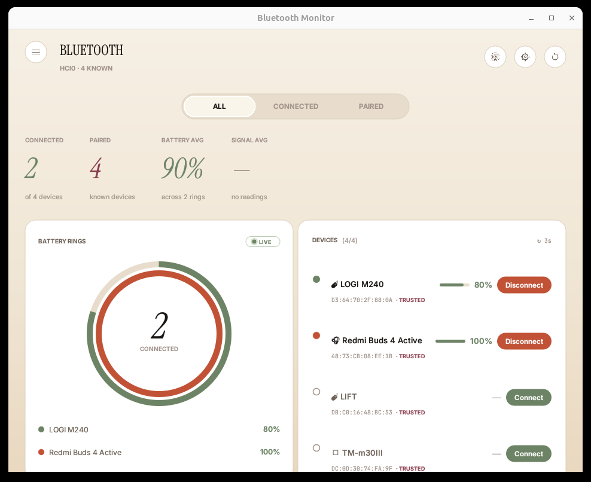

<p align="center">
  
</p>

<h1 align="center">Bluetooth Monitor</h1>

<p align="center">
  A calm dashboard for your Bluetooth devices on Linux.<br>
  Live battery, signal, discovery, tray icon &mdash; four hand-tuned themes.
</p>

<p align="center">
  <a href="#build"></a>
  <a href="LICENSE"></a>
  
  
</p>

---

## Screenshots

<table>
<tr>
  <td width="50%"></td>
  <td width="50%"></td>
</tr>
<tr>
  <td align="center"><strong>Aurora</strong> &mdash; deep violet gradient · Inter Light</td>
  <td align="center"><strong>Nova</strong> &mdash; charcoal + indigo · Space Grotesk</td>
</tr>
<tr>
  <td width="50%"></td>
  <td width="50%"></td>
</tr>
<tr>
  <td align="center"><strong>Command</strong> &mdash; terminal · JetBrains Mono</td>
  <td align="center"><strong>Radiant</strong> &mdash; light editorial · Instrument Serif Italic</td>
</tr>
</table>

## What it does

- **Live dashboard** &mdash; every connected device with its battery percentage,
  RSSI signal, and connection state. Auto-refresh every 1&nbsp;s / 3&nbsp;s / 5&nbsp;s / 10&nbsp;s / 30&nbsp;s.
- **Battery rings** &mdash; a donut with one ring per connected device, colored to
  match the row it belongs to.
- **Device detail** &mdash; click a row to open a full page with metrics, services,
  vendor / class info, and the connect / trust / block / remove actions.
- **Discover** &mdash; radar view that streams `AdapterEvent::DeviceAdded` from BlueZ
  and lets you pair on the spot.
- **Tray icon** &mdash; StatusNotifierItem via `ksni`. Tooltip lists connected devices
  with battery. Menu can toggle the window, force a refresh, or quit.
- **Four themes** with real structural differences (background style, corner radius,
  hero font family) &mdash; not just recolors.
- **Persistent config** &mdash; theme + preferences saved to
  `~/.config/bt-monitor/config.toml`.

## Requirements

- Linux with BlueZ 5.48+ (5.72 tested)
- A Bluetooth adapter (`hci0`)
- `libdbus-1-dev` (for `dbus` used by `bluer` and `ksni`)
- Rust 1.95+ if building from source

The tray icon requires an environment that speaks StatusNotifierItem
(KDE / XFCE / Cinnamon / GNOME with the AppIndicator extension). The rest of
the app works even without a tray.

## Install

### Prebuilt binary (Linux x86_64)

Grab the latest tar.gz from
[Releases](https://github.com/pedrokarim/bluetooth-monitor/releases) and
run it directly:

```bash
tar -xzf bluetooth-monitor-*-linux-x86_64.tar.gz
./bluetooth-monitor-*-linux-x86_64
```

### From source with `install.sh` (user-space, no sudo)

```bash
git clone https://github.com/pedrokarim/bluetooth-monitor.git
cd bluetooth-monitor
./install.sh
```

This builds a release binary and installs everything under `~/.local`:

| File | Path |
|---|---|
| Binary | `~/.local/bin/bluetooth-monitor` |
| Desktop entry | `~/.local/share/applications/bluetooth-monitor.desktop` |
| Icon | `~/.local/share/icons/hicolor/512x512/apps/bluetooth-monitor.png` |
| Autostart (if enabled) | `~/.config/autostart/bluetooth-monitor.desktop` |
| User config | `~/.config/bt-monitor/config.toml` |

Once installed, launch from your desktop menu (search **Bluetooth Monitor**)
or from a shell with `bluetooth-monitor`.

To uninstall:

```bash
./install.sh --uninstall
```

### Or use the Makefile

```bash
make                   # release build
make install-with-build
make uninstall
make run               # build + launch
make check             # what CI runs
```

### Build only

```bash
cargo build --release
./target/release/bluetooth-monitor
```

The binary is fully self-contained: fonts (Inter, Space Grotesk, Instrument
Serif, JetBrains Mono) and icons are embedded via `include_bytes!`.

## Configuration

`~/.config/bt-monitor/config.toml` is created on first run:

```toml
theme = "aurora"              # aurora | nova | command | radiant
refresh_interval_secs = 3     # 1 | 3 | 5 | 10 | 30
close_to_tray = true          # keep running when window is closed
low_battery_alert = true      # notify on low battery
low_battery_threshold = 20    # percentage that triggers the alert
autostart = false             # launch at login
```

All values are also editable from the **Settings** screen.

## Themes

Each theme is more than a palette &mdash; it flips background style, corner
radius, and typography family for the hero numbers.

| Theme    | Background     | Card radius | Chip radius | Hero font                |
|----------|----------------|-------------|-------------|--------------------------|
| Aurora   | 3-stop violet gradient | 22 px       | full circle | Inter Light              |
| Nova     | Solid charcoal | 12 px       | 8 px        | Space Grotesk            |
| Command  | Solid black    | 2 px        | 2 px        | JetBrains Mono           |
| Radiant  | Warm cream gradient | 18 px  | full circle | Instrument Serif Italic  |

See [`DESIGN_SYSTEM.md`](DESIGN_SYSTEM.md) for the full design tokens and the
[`mockups/`](mockups/) folder for the original HTML prototypes.

## Architecture

```
src/
├── main.rs        # eframe entry, App impl, splash timing, viewport lifecycle
├── ui.rs          # every screen: splash, dashboard, discover, detail, settings
├── theme.rs       # 4 Theme instances, style application, gradient painter
├── fonts.rs       # font registration for Inter / Space Grotesk / Instrument / JBM
├── bluetooth.rs   # tokio backend over bluer, refresh loop, discovery task
├── tray.rs        # ksni StatusNotifierItem tray
└── config.rs      # TOML load/save under ~/.config/bt-monitor/
```

The backend runs on a dedicated `tokio` runtime in a background thread and
communicates with the UI through:

- `Arc<Mutex<Vec<DeviceInfo>>>` &mdash; the current device list
- `mpsc::UnboundedSender<BluetoothCommand>` &mdash; UI &rarr; backend actions
- Shared atomics for adapter state, scanning flag, quit / visible flags

## Contributing

Contributions welcome. See [`CONTRIBUTORS.md`](CONTRIBUTORS.md).

Before opening a PR:

```bash
cargo fmt
cargo clippy -- -D warnings
cargo build --release
```

## Acknowledgments

- **[bluer](https://github.com/bluez/bluer)** &mdash; BlueZ D-Bus client in Rust
- **[egui](https://github.com/emilk/egui) / [eframe](https://github.com/emilk/egui/tree/master/crates/eframe)** &mdash; the immediate-mode UI toolkit
- **[ksni](https://github.com/iovxw/ksni)** &mdash; StatusNotifierItem tray
- **[Inter](https://rsms.me/inter/)**, **[Space Grotesk](https://fonts.google.com/specimen/Space+Grotesk)**, **[Instrument Serif](https://fonts.google.com/specimen/Instrument+Serif)**, **[JetBrains Mono](https://www.jetbrains.com/lp/mono/)** &mdash; the four typefaces that make the themes distinct

## License

[MIT](LICENSE) &copy; 2026 [Karim](https://github.com/pedrokarim)
